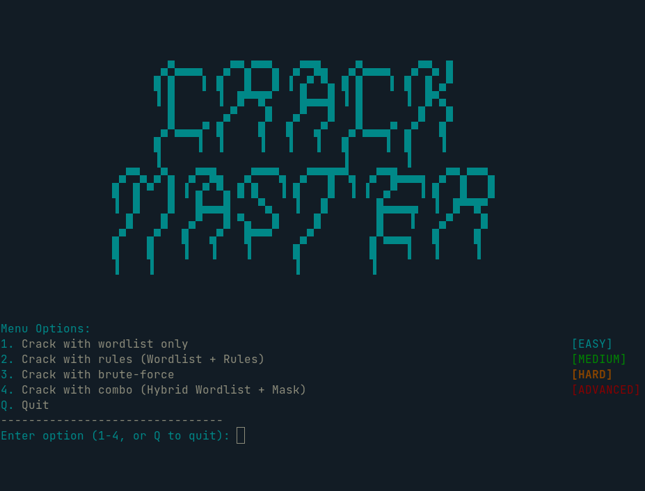
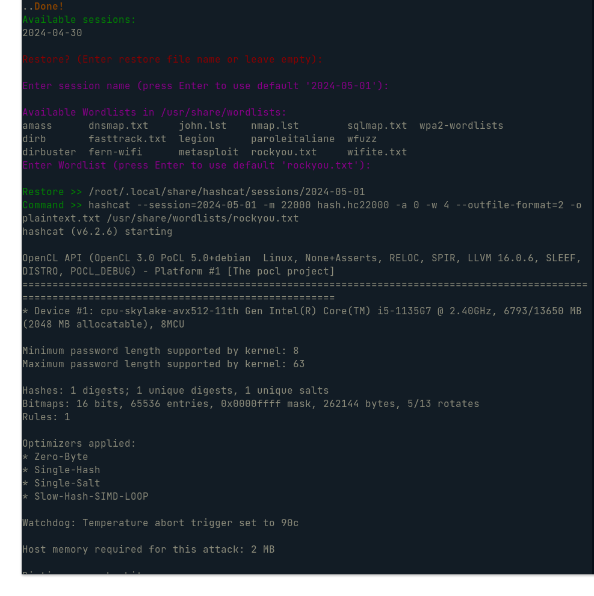

# Crack_Master
An awareness based Bash script to perform cracking operations with Hashcat. This software is openly inspired by the TV Show "Mr. Robot"


## Disclaimer
This program is provided without warranties of any kind. The author assumes no responsibility for any damages resulting from the use of this software. We recommend that you use it only for lawful purposes and in accordance with local laws.

## Description
This Bash script provides a simple interface to perform cracking operations using Hashcat. It offers various options such as cracking with wordlists, rules, brute-force, and hybrid wordlist + mask attacks. The program is enriched with comments in order to make it as usable and minimal as possible.

## Features
- Crack passwords using wordlists, rules, or brute-force methods.
- Perform hybrid attacks combining wordlists and masks.
- Easy-to-use menu interface for selecting cracking options.
- Supports session restoration for interrupted cracking sessions.





## Requirements
- Linux operating system
- Hashcat installed (`sudo apt install hashcat`)
- Wordlists, rules, and masks available in the specified paths

## Installation
To begin, clone the repository using `git clone https://github.com/ente0v1/Crack_Master.git` in your $HOME directory, then navigate into the CrackMaster folder by typing `cd Crack_Master`. After that, make all scripts executable with `chmod +x *`, and proceed to move "hash.hc22000" in your repo root directory. With these steps completed, you're now ready to run the script by executing `./crackmaster.sh`.

Commands to execute:
```bash
git clone https://github.com/ente0v1/Crack_Master.git)
mv Crack_Master $HOME
cd $HOME/Crack_Master
chmod +x *
```

## Usage
To start Crack_Master rename your hash in "hash.hc22000" move your hash into the root directory and execute: `./crackmaster.sh`



## Help
If you want more information about how hashcat's attack methods work, I recommend reading the official [Hashcat Wiki](https://hashcat.net/wiki/) and the repo file named `crackwiki.txt`
